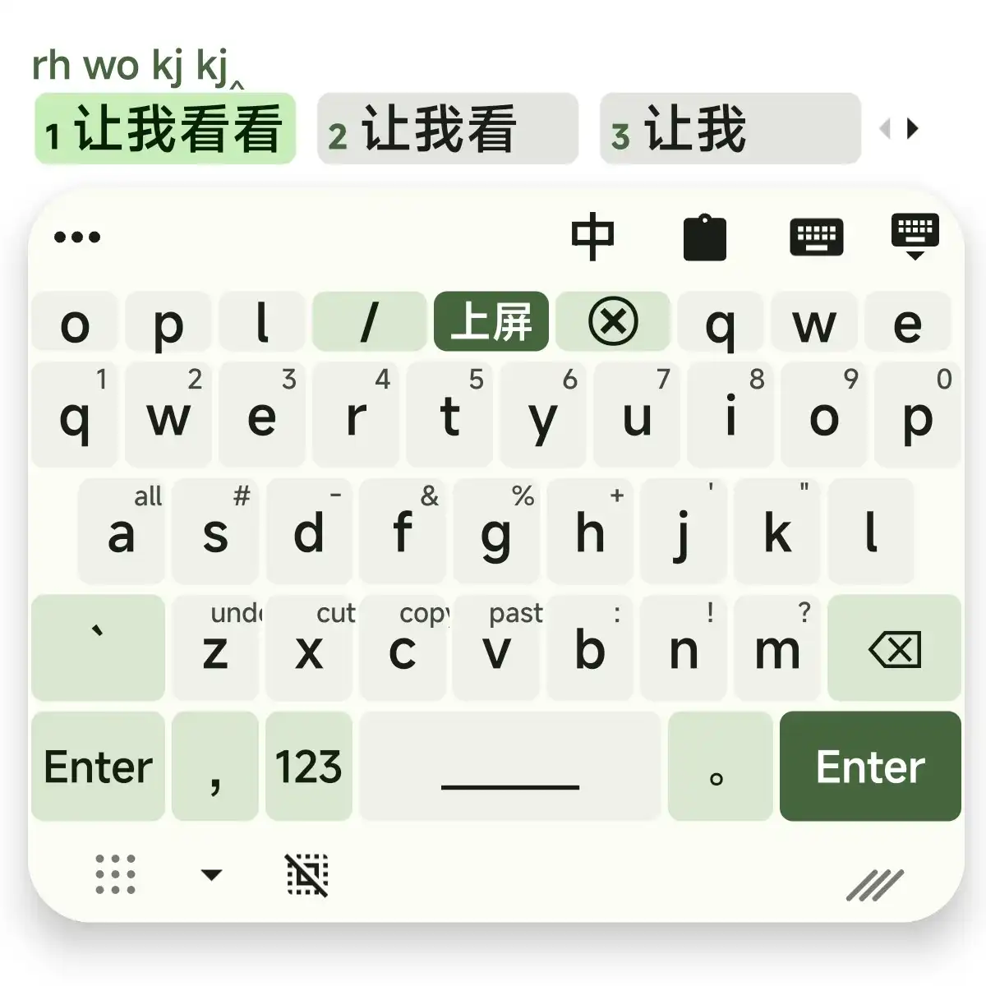
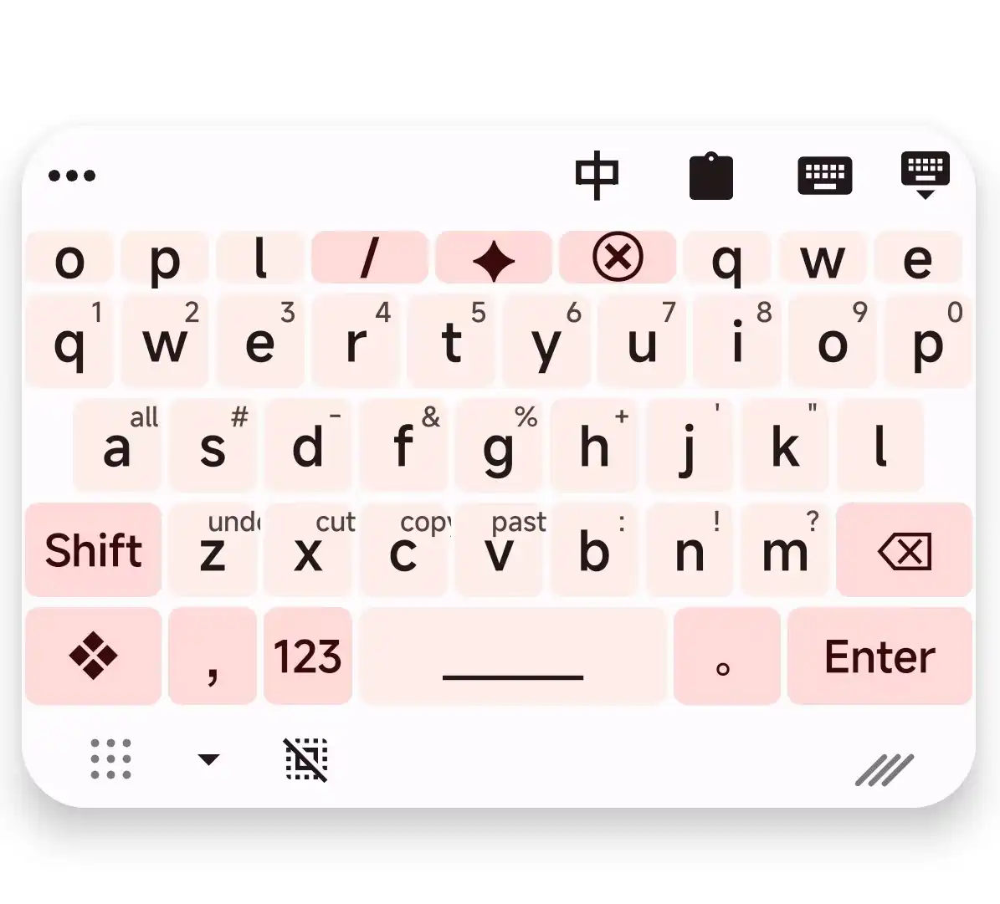
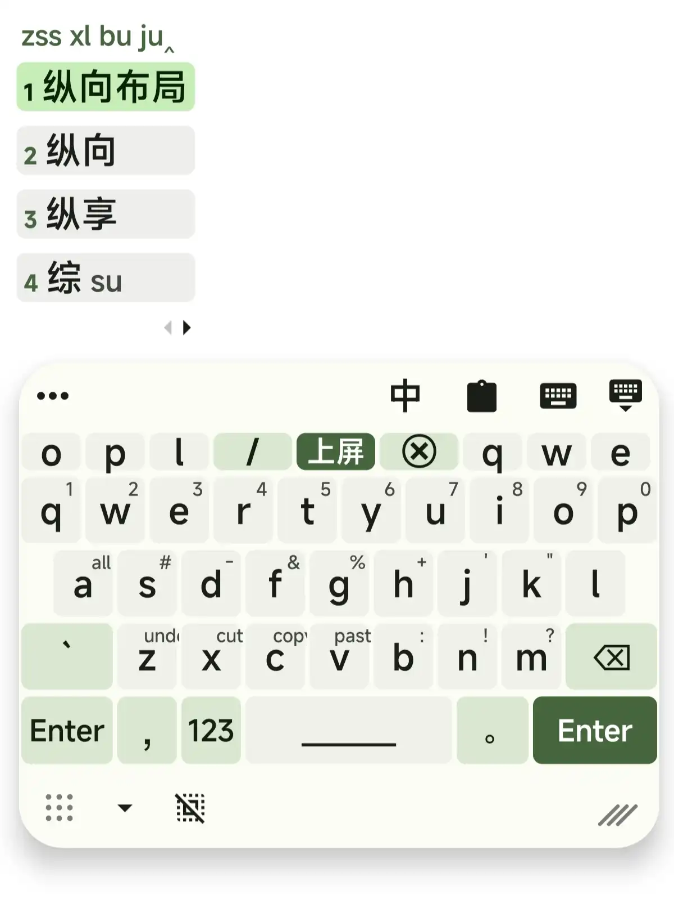
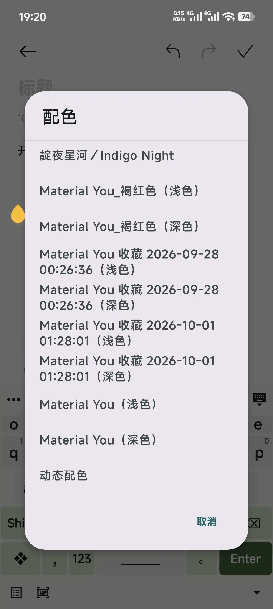
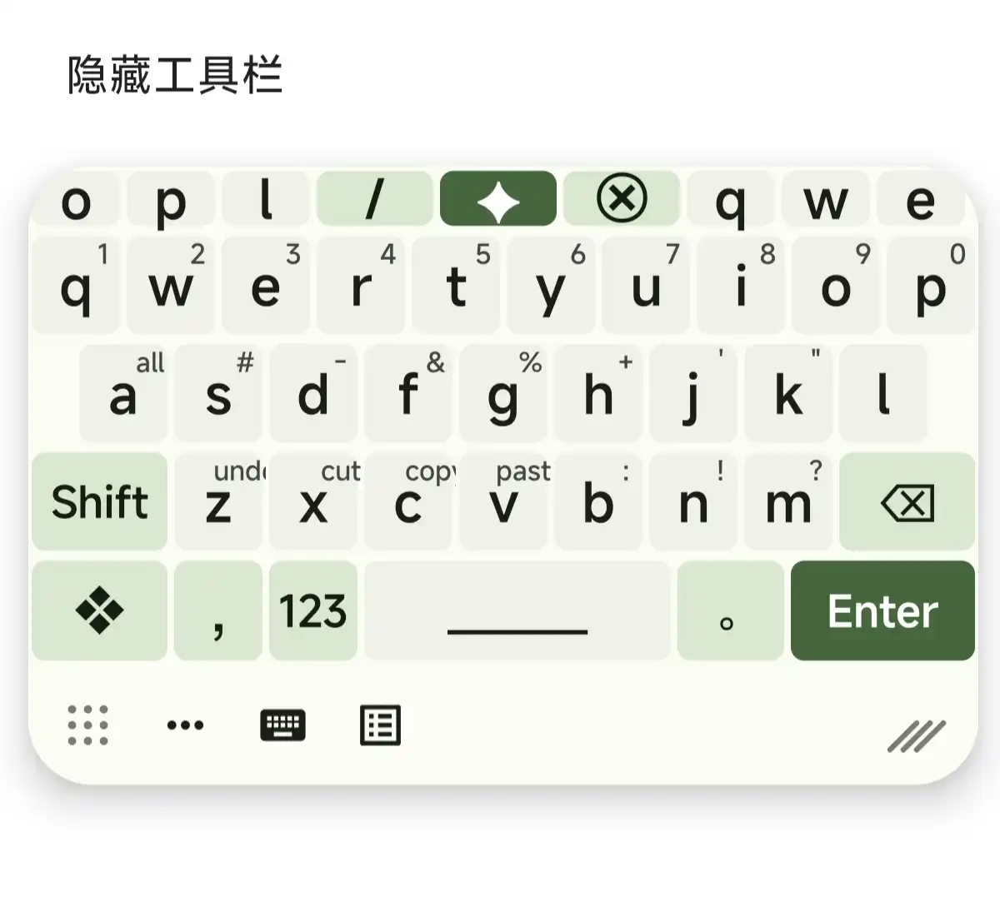
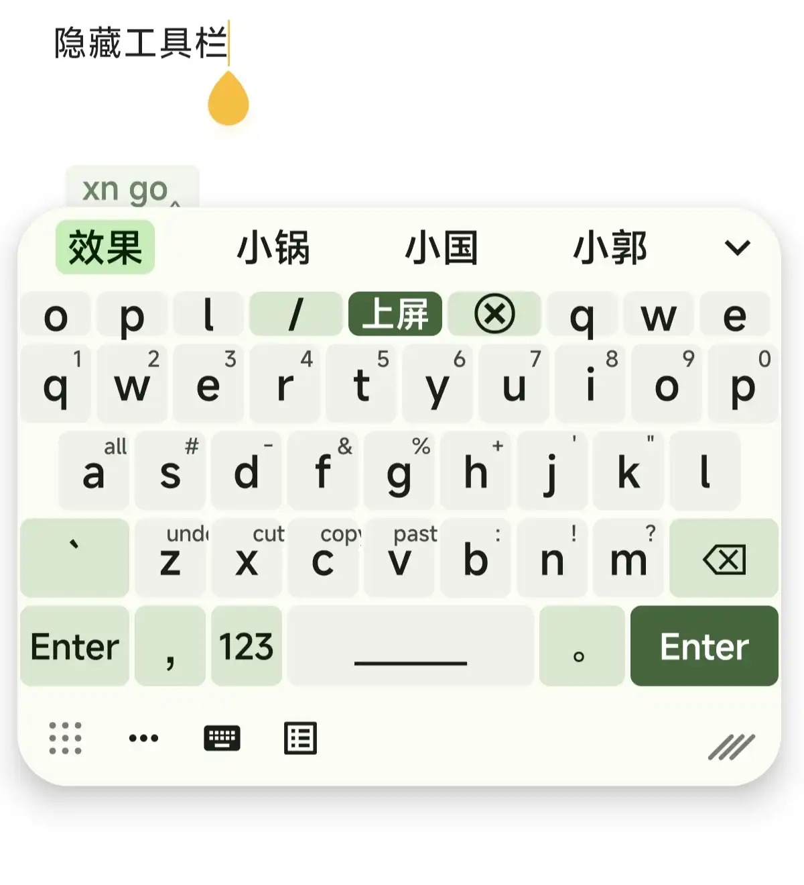

<!--
SPDX-FileCopyrightText: 2015 - 2024 Rime community

SPDX-License-Identifier: GPL-3.0-or-later
-->

# Trime —— 个人修改版（Personal Modified Build）

本仓库是作者个人修改的 Trime 版本，并非新项目：全部内容基于原项目 同文输入法 Trime 修改而来，
与原项目**无隶属关系，也不是官方发布版**。原代码、文档与素材的著作权归 Rime community 所有，
许可证为 GPL-3.0-or-later。遇到问题请在本仓库反馈，**不要**提到原项目去。

本仓库相对原版的改动，是在 AI 助手辅助下以「vibe coding」方式完成的：作者用自然语言描述需求，
由 AI 编写与修改代码，随后每一项改动都在真机上验证过。它能满足作者本人的日常使用，
但**没有经过原项目维护者评审**，请当作未评审的个人构建来看待。

## 这个构建加了什么

下面每一项都是相对原版新增或改动的功能，截图取自作者自己的设备（截图里的配色是作者自用主题，
不属于本仓库的改动）。设置项都在「设置 → 键盘 / 键盘布局 / 配色」里。

### 悬浮键盘

键盘可以拖到屏幕任意位置浮动，也能用右下角的抓手缩放；两指拖动移动，单指在键区上仍是正常打字。

- 宽度按**屏幕短边**计算，横竖屏切换后物理宽度不变（不会在横屏突然铺满、竖屏变成一条）。
- 拖动有绝对下限，缩放有上限；键盘**不会被拖出屏幕外**。
- 悬浮时修掉了输入卡顿：insets 更新改为按需触发，触摸区域几何缓存，两指拖动要等手指真的移动了才接管手势
  （否则第二根手指落下瞬间会把正在按的键也一起取消）。
- 预编辑栏跟随键盘移动，缩放同步。

### 候选窗口增强

- 每行候选数可设置；超出时在页内步进翻页，而不是把多出来的候选直接截掉（截掉就再也点不到了）。
- 新增候选背景色、背景透明度、候选间距三项设置，间距按布局方向（横向/纵向）生效。
- 候选宽度按真实控件测量：原来用裸 `TextPaint` 测量带样式 span 的文本会算窄，导致整行被省略号截断；
  现在先缩放再省略。

### 内置动态配色（Material You）

- 配色列表里多出一个**内置「动态配色」**方案，取自系统 Material You 调色板（Android 12+）。
- 它以固定 id 追加进可选列表，主题既藏不住它也顶不掉它；配色列表与键盘上的配色键走同一份列表。
- 配色列表会**标出当前生效的方案**（✓ 前缀 + 加粗），并自动滚动到它，方案多的时候不用逐条找。

### 底部开关栏

底部三个开关（隐藏工具栏 / 悬浮键盘 / 候选窗口）现在有自己的一条区域，不再和按键抢位置。

- 「设置 → 键盘 → 独立底部栏」可整条关掉，高度可调（0 = 自动，保证不压到按键）。
- 底栏背景跟随所选配色的键盘背景色，三个开关图标跟随按键文字色。
- 「底部开关边距」只控制**左右**：原先它连纵向一起推，看起来像四边都在变。
- 隐藏工具栏后，底栏里的入口图标会自动从「收起」变成「展开」（工具栏显隐是原版就有的功能，
  这里只是让它和新的底栏一致）。

### 浮层不再「一点就闪」

剪贴板长按菜单、候选操作菜单、以及方案里用 `options` 声明的开关菜单，都换成了输入法专用的浮层实现：
原版借用的系统 `PopupMenu` 会在输入法里带上 `FLAG_ALT_FOCUSABLE_IM`，导致编辑器与输入法断开连接、
输入会话被重启，表现为**面板一点就消失**（不崩，但功能用不了）。新浮层还会挑空间更大的一侧展开，
靠底部时不会被挤出屏幕。

### 输入卡顿与其它修复

- 悬浮键盘下的输入延迟（见上）。
- 13 处每击键路径上的 `rime.run { … }` 换成零阻塞访问器：原写法会跑事件循环并阻塞主线程。
- 剪贴板：输出规则里的空行不再「匹配一切」（默认配置下曾导致复制内容一律不入库）；批量删除不再误删置顶项。
- 两个 Room 数据库（剪贴板 / 收藏）共用一份迁移列表，不会再出现「一个库升了、另一个没升」而崩溃。

## 获取与安装

- 打包产物在 [Releases](https://github.com/lanlanderui/trime-android/releases) 里，是 **debug 构建**
  （debug 签名、可调试），仅供个人使用与朋友之间分发，不适合上架应用商店。
- 只有 **arm64-v8a** 架构，没有 32 位版本。
- 包名是 `com.osfans.trime.debug`，**与官方同文不冲突**，可以共存；输入法列表里显示为 **Trime (Debug)**。
- 内置朙月拼音（简/繁）、全拼、笔画等方案，装完即可用，首次启动会自动部署配置。
